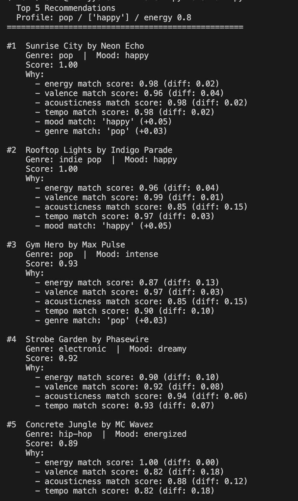
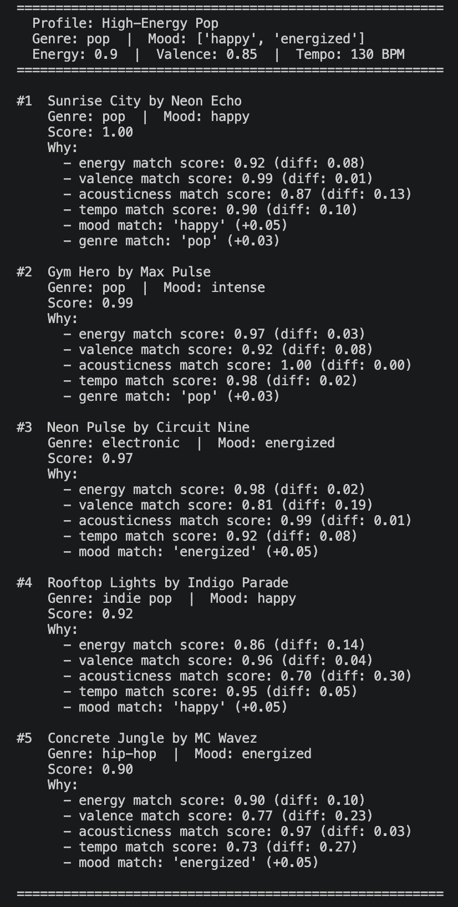
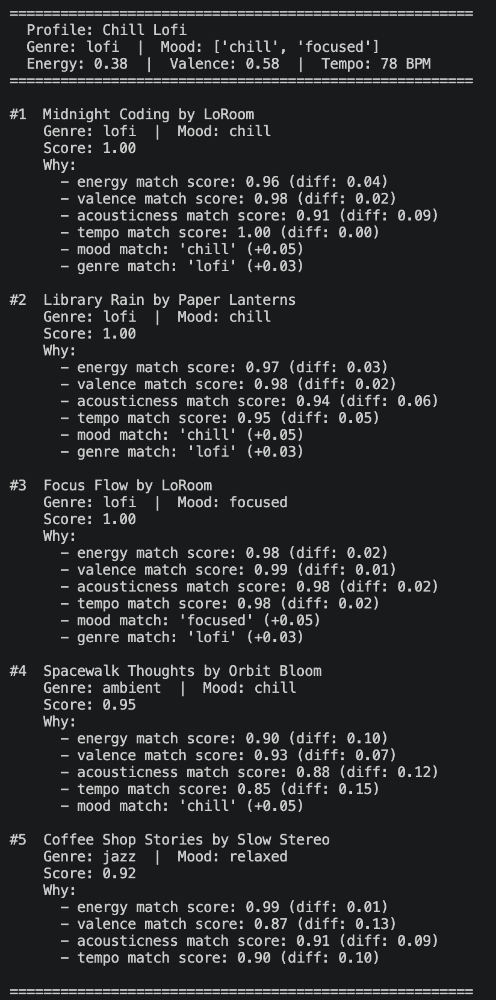
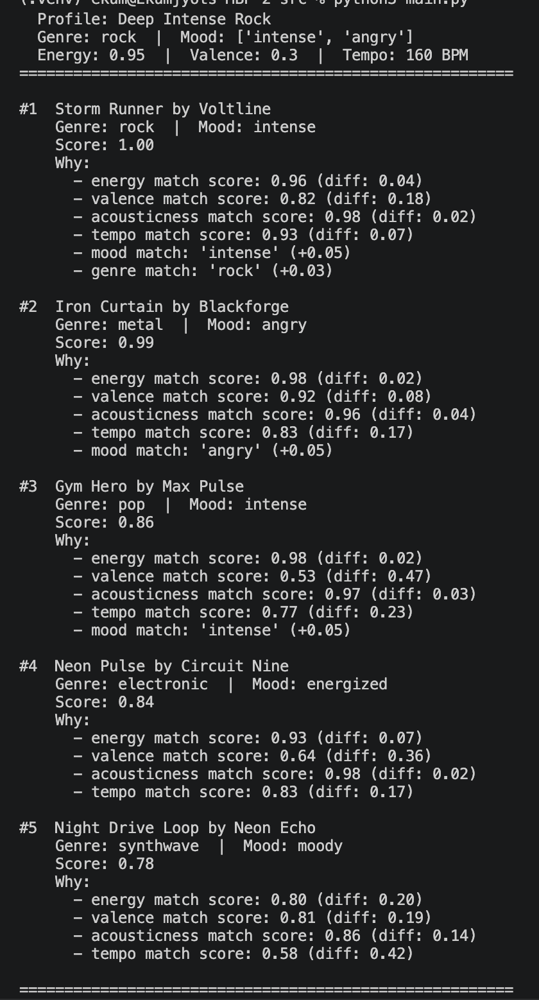
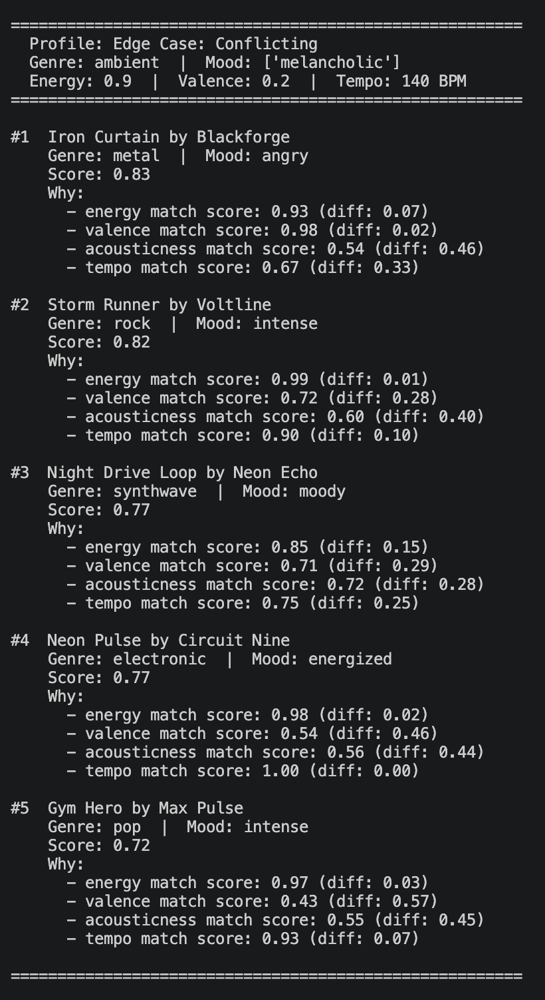
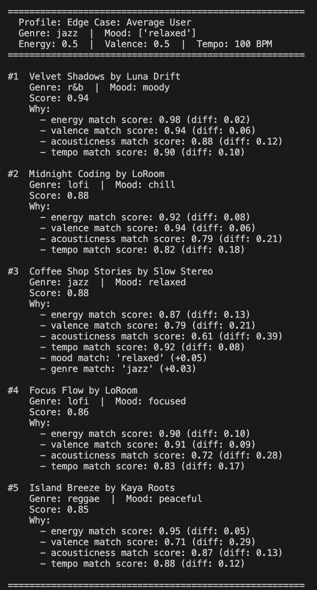
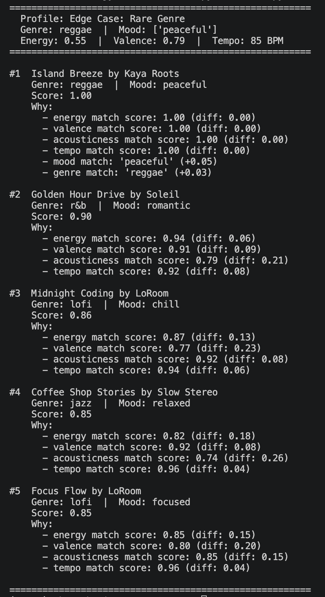
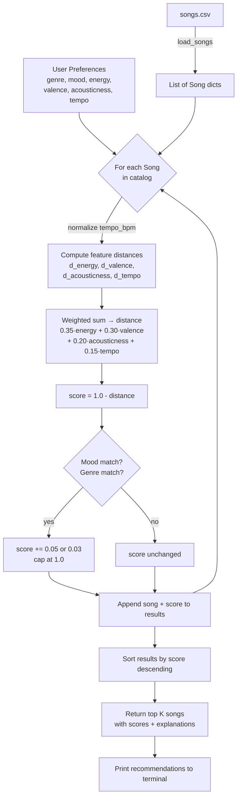

# 🎵 Music Recommender Simulation

## Project Summary

VibeCheck is a content-based music recommender simulation built in Python. It takes a user taste profile — genre, mood, energy, valence, acousticness, and tempo — and scores every song in a 20-song catalog by how closely it matches those preferences. It returns the top results with a plain-language explanation for each pick so you can see exactly why a song was recommended.

The goal was to understand how real recommendation systems like Spotify and YouTube work under the hood — specifically how basic machine learning concepts like distance, weighting, and ranking scale up into something that feels like personalized music discovery.

---

## How The System Works

Each song is represented by...

4 numeric audio features:
  - Energy
  - Valence
  - Acousticness
  - Tempo_bpm

And 2 categorical labels:
  - mood
  - genre

The numeric features help capture the vibe (how intense, emotional, and how fast a song is, etc), while the labels act as lightweight tiebreakers.

The userProfile stores a single seed song chosen by the user. That song's feature values become the anchor everything else is compared against.

To be more specific, the userProfile stores:
  - seed_song: the song the user selected
  - seed features used for comparison: energy, valence, acousticness, tempo_bpm, mood, genre

The recommender scores every other song by computing the weighted difference between its features and the seed's. Energy carries the most weight, followed by valence, acousticness, and tempo. The differences are summed into a distance value, then flipped into a similarity score. Small bonuses are added when a candidate shares the seed's mood or genre. Songs are then ranked highest to lowest with the top results being the recommendations.

**Algorithm Recipe:**

  1. Normalize tempo_bpm to a 0–1 scale so it's comparable to the other features
  2. Compute the absolute difference between the user's target and each song's value for energy, valence, acousticness, and tempo
  3. Multiply each difference by its weight and sum them into one distance value:
     - Energy: 0.35 (strongest signal)
     - Valence: 0.30 (emotional tone)
     - Acousticness: 0.20 (texture)
     - Tempo: 0.15 (context fit)
  4. Flip the distance into a similarity score: score = 1.0 - distance
  5. Add small bonuses: +0.05 if mood matches, +0.03 if genre matches (capped at 1.0)
  6. Sort all songs by score descending, return top K

**Potential Biases:**

  - This system might over-prioritize energy, causing it to miss songs that match the user's mood but sit at a slightly different intensity level
  - Genre matching gives a small bonus but can't account for how different two songs in the same genre can actually sound
  - With only 20 songs in the catalog, certain moods and genres are underrepresented, so some users will get narrower results than others
  - The weights are fixed — a user who cares more about tempo than valence has no way to express that

Platforms like Spotify and YouTube don't rely on a single seed song. They build a full behavioral profile per user with every listen, skip, replay, save, and search across millions of tracks. They then combine two approaches: **collaborative filtering** (finding users with similar behavior and surfacing what those users loved) and **content based filtering** (matching audio features directly, the same principle our system uses). Both signals feed into deep neural networks that re-rank hundreds of candidates in milliseconds for every user, every session, at global scale.

This version isolates just the content-based layer with no history and no neural network.

---

## Terminal Output

### Default Profile (Pop / Happy)


### Stress Test Results

**High-Energy Pop**


**Chill Lofi**


**Deep Intense Rock**


**Edge Case: Conflicting Preferences (high energy + melancholic mood)**


**Edge Case: Average User (all features at 0.5)**


**Edge Case: Rare Genre (reggae — only 1 song in catalog)**


---

## Data Flow

Input (User Preferences) → Process (Score every song) → Output (Top K Recommendations)



---

## Getting Started

### Setup

1. Create a virtual environment (optional but recommended):

   ```bash
   python -m venv .venv
   source .venv/bin/activate      # Mac or Linux
   .venv\Scripts\activate         # Windows

2. Install dependencies

```bash
pip install -r requirements.txt
```

3. Run the app:

```bash
python -m src.main
```

### Running Tests

Run the starter tests with:

```bash
pytest
```

You can add more tests in `tests/test_recommender.py`.

---

## Experiments You Tried

6 different user profiles were tested to stress test the scoring logic:

- High-Energy Pop and Chill Lofi produced clean, expected results — the energy and acousticness features alone split the catalog into two distinct clusters
- Deep Intense Rock correctly surfaced Storm Runner and Iron Curtain at the top, showing that low valence + high energy works as a signal for dark/intense music
- The conflicting profile (high energy + melancholic mood) revealed that when no song matches all preferences, energy dominates and mood gets ignored
- The average user profile (all features at 0.5) returned scattered results across multiple genres, showing the system has no way to handle users without strong preferences
- The rare genre profile (reggae) got a perfect 1.00 for its one matching song, then fell into cross-genre results — showing catalog size directly limits variety

---

## Limitations and Risks

- Only works on a 20-song catalog — not enough variety for niche genres and moods
- Does not understand lyrics, language, or cultural context
- Energy is weighted so heavily that it can override mood and genre preferences
- Fixed weights mean every user is scored the same way regardless of what they actually care about
- No listening history — can't learn or improve from user behavior over time

Full breakdown in the [Model Card](model_card.md).

---

## Reflection

My biggest learning moment during this project was the initial understanding of the project. It really took me some time to figure out the general idea and how it all worked overall. But dwelving into it I find recommendation systems cooler and cooler. I just hadn't realized how much went into them. And I am genuinely curious how they work at large companies like is one team in charge of this tiny part of the whole system and then it just flows together or like how does that all work. Or is it like one team in charge of the whole thing? I think AI tools really helped me for this project especially with the math and weights and such, I only double checked the results to see if they sort of felt right. Its interesting to see how it can be reduced to math, honestly I think our brain also kind of reduces it to an inherent math that we just can't tell. I think I would like to mimic spotify and really add more complex ML to it just to learn cause I am very very very curious and I think it would be reallllly cool to build. 