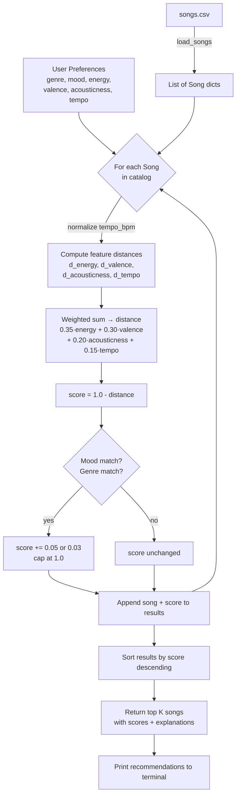

# 🎵 Music Recommender Simulation

## Project Summary

In this project you will build and explain a small music recommender system.

Your goal is to:

- Represent songs and a user "taste profile" as data
- Design a scoring rule that turns that data into recommendations
- Evaluate what your system gets right and wrong
- Reflect on how this mirrors real world AI recommenders

Replace this paragraph with your own summary of what your version does.

---

## How The System Works

Each song is represented by...

4 numeric audio features:
  - Energy
  - Valence
  - Acousticness
  - Tempo_bpm

And 2 categorical labels:
  - mood
  - genre

The numeric features help capture the vibe (how intense, emotional, and how fast a song is, etc), while the labels act as lightweight tiebreakers.

The userProfile stores a single seed song chosen by the user. That song's feature values become the anchor everything else is compared against.

To be more specific, the userProfile stores:
  - seed_song: the song the user selected
  - seed features used for comparison: energy, valence, acousticness, tempo_bpm, mood, genre

The recommender scores every other song by computing the weighted difference between its features and the seed's. Energy carries the most weight, followed by valence, acousticness, and tempo. The differences are summed into a distance value, then flipped into a similarity score. Small bonuses are added when a candidate shares the seed's mood or genre. Songs are then ranked highest to lowest with the top results being the recommendations.

**Algorithm Recipe:**

  1. Normalize tempo_bpm to a 0–1 scale so it's comparable to the other features
  2. Compute the absolute difference between the user's target and each song's value for energy, valence, acousticness, and tempo
  3. Multiply each difference by its weight and sum them into one distance value:
     - Energy: 0.35 (strongest signal)
     - Valence: 0.30 (emotional tone)
     - Acousticness: 0.20 (texture)
     - Tempo: 0.15 (context fit)
  4. Flip the distance into a similarity score: score = 1.0 - distance
  5. Add small bonuses: +0.05 if mood matches, +0.03 if genre matches (capped at 1.0)
  6. Sort all songs by score descending, return top K

**Potential Biases:**

  - This system might over-prioritize energy, causing it to miss songs that match the user's mood but sit at a slightly different intensity level
  - Genre matching gives a small bonus but can't account for how different two songs in the same genre can actually sound
  - With only 20 songs in the catalog, certain moods and genres are underrepresented, so some users will get narrower results than others
  - The weights are fixed — a user who cares more about tempo than valence has no way to express that

Platforms like Spotify and YouTube don't rely on a single seed song. They build a full behavioral profile per user with every listen, skip, replay, save, and search across millions of tracks. They then combine two approaches: **collaborative filtering** (finding users with similar behavior and surfacing what those users loved) and **content based filtering** (matching audio features directly, the same principle our system uses). Both signals feed into deep neural networks that re-rank hundreds of candidates in milliseconds for every user, every session, at global scale.

This version isolates just the content-based layer with no history and no neural network.

---

## Data Flow

Input (User Preferences) → Process (Score every song) → Output (Top K Recommendations)



---

## Getting Started

### Setup

1. Create a virtual environment (optional but recommended):

   ```bash
   python -m venv .venv
   source .venv/bin/activate      # Mac or Linux
   .venv\Scripts\activate         # Windows

2. Install dependencies

```bash
pip install -r requirements.txt
```

3. Run the app:

```bash
python -m src.main
```

### Running Tests

Run the starter tests with:

```bash
pytest
```

You can add more tests in `tests/test_recommender.py`.

---

## Experiments You Tried

Use this section to document the experiments you ran. For example:

- What happened when you changed the weight on genre from 2.0 to 0.5
- What happened when you added tempo or valence to the score
- How did your system behave for different types of users

---

## Limitations and Risks

Summarize some limitations of your recommender.

Examples:

- It only works on a tiny catalog
- It does not understand lyrics or language
- It might over favor one genre or mood

You will go deeper on this in your model card.

---

## Reflection

Read and complete `model_card.md`:

[**Model Card**](model_card.md)

Write 1 to 2 paragraphs here about what you learned:

- about how recommenders turn data into predictions
- about where bias or unfairness could show up in systems like this


---

## 7. `model_card_template.md`

Combines reflection and model card framing from the Module 3 guidance. :contentReference[oaicite:2]{index=2}  

```markdown
# 🎧 Model Card - Music Recommender Simulation

## 1. Model Name

Give your recommender a name, for example:

> VibeFinder 1.0

---

## 2. Intended Use

- What is this system trying to do
- Who is it for

Example:

> This model suggests 3 to 5 songs from a small catalog based on a user's preferred genre, mood, and energy level. It is for classroom exploration only, not for real users.

---

## 3. How It Works (Short Explanation)

Describe your scoring logic in plain language.

- What features of each song does it consider
- What information about the user does it use
- How does it turn those into a number

Try to avoid code in this section, treat it like an explanation to a non programmer.

---

## 4. Data

Describe your dataset.

- How many songs are in `data/songs.csv`
- Did you add or remove any songs
- What kinds of genres or moods are represented
- Whose taste does this data mostly reflect

---

## 5. Strengths

Where does your recommender work well

You can think about:
- Situations where the top results "felt right"
- Particular user profiles it served well
- Simplicity or transparency benefits

---

## 6. Limitations and Bias

Where does your recommender struggle

Some prompts:
- Does it ignore some genres or moods
- Does it treat all users as if they have the same taste shape
- Is it biased toward high energy or one genre by default
- How could this be unfair if used in a real product

---

## 7. Evaluation

How did you check your system

Examples:
- You tried multiple user profiles and wrote down whether the results matched your expectations
- You compared your simulation to what a real app like Spotify or YouTube tends to recommend
- You wrote tests for your scoring logic

You do not need a numeric metric, but if you used one, explain what it measures.

---

## 8. Future Work

If you had more time, how would you improve this recommender

Examples:

- Add support for multiple users and "group vibe" recommendations
- Balance diversity of songs instead of always picking the closest match
- Use more features, like tempo ranges or lyric themes

---

## 9. Personal Reflection

A few sentences about what you learned:

- What surprised you about how your system behaved
- How did building this change how you think about real music recommenders
- Where do you think human judgment still matters, even if the model seems "smart"

